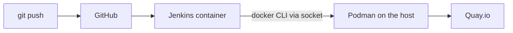

# jenkins-lab

I built this lab to learn Jenkins hands-on: a CI pipeline that builds a container image on every commit, tests it, and pushes it to Quay.io.

It runs on my Fedora workstation, with Jenkins in a rootless Podman container. Some choices here are lab shortcuts, not what I'd do in production (see the last section).

## How it works



Jenkins runs from a custom image (`jenkins/jenkins:lts` + the Docker CLI, see `jenkins/Dockerfile`). The CLI talks to the Podman API socket of my user, so images and test containers are actually created by Podman on the host, next to the Jenkins container.

The pipeline (`Jenkinsfile`, declarative):

- **Build**: tags the image as `myapp:<build number>-<short commit hash>` and builds it. No `latest`: every image can be traced back to its commit, and rollback means going back to a known tag.
- **Test**: starts a container from the new image and checks that nginx serves the page. If the check fails, the stage exits non-zero and the pipeline stops.
- **Push**: logs in to Quay.io with a robot account (write access to this repo only) and pushes the image.
- **Post**: always removes the test container and logs out, even if the build failed.

Credentials are stored in Jenkins and used with `withCredentials`. The login step uses single quotes so the password is expanded by the shell and not by Groovy, and `--password-stdin` so it never shows up in the process list.

The app image is just two lines on top of `nginx-unprivileged`: it runs as non-root on port 8080.

## Things that broke (and what I learned)

- **Permission denied on the Podman socket.** In rootless Podman, root inside the container is my user on the host, but the `jenkins` user maps to a sub-UID with no access to the socket. SELinux was blocking it too. For the lab I run the container as root and disable SELinux labeling for that container only.
- **Git refusing the repo after I changed the container user.** The files in the Jenkins volume still belonged to the old user, and Git's `safe.directory` check refuses repos owned by someone else, even for root. Fixed with `chown`.
- **`Connection refused` on localhost in the test.** BusyBox `wget` resolved `localhost` to `::1`, but nginx was only listening on IPv4. Switched to `127.0.0.1`.
- **Push failing with a 500 and no message.** Login worked, push didn't. Pushing by hand with Podman showed the real error: the repo didn't exist on Quay and the robot account had no write permission. Login succeeding doesn't mean you're allowed to push.

## What I'd do differently in production

No container engine socket mounted into Jenkins, and no SELinux exceptions. Builds would run on ephemeral agents (one pod per build via the Kubernetes plugin, 0 executors on the controller), with Buildah/Kaniko or OpenShift BuildConfigs to build images.

## Run it

```bash
systemctl --user enable --now podman.socket
podman build -t my-jenkins:1 jenkins/
podman run -d --name jenkins -p 8080:8080 \
  -v jenkins_vol:/var/jenkins_home \
  -v /run/user/$(id -u)/podman/podman.sock:/var/run/docker.sock \
  --user root --security-opt label=disable \
  localhost/my-jenkins:1
```

Then create a Pipeline job with "Pipeline script from SCM" pointing to this repo, and add a `quay-creds` username/password credential.

## Next

- [ ] Deploy stage to OpenShift
- [ ] Trigger builds from a GitHub webhook
